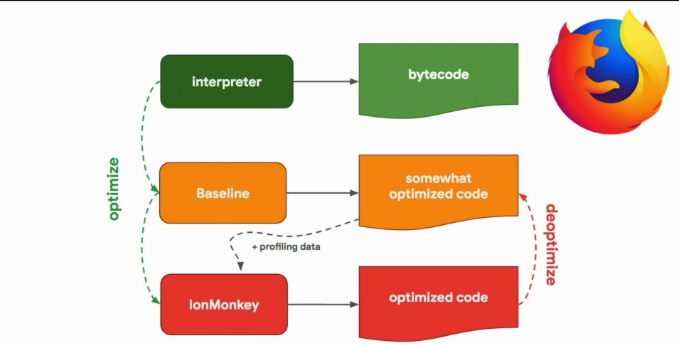

# JS Engine

### Available JS Engines
#### Google V8
Powers the JS for `chrome` and `node`.

#### Mozilla SpiderMonkey
Powers the JS for `firefox` and there is even a `node` flavour that uses it (SpiderNode).

#### Microsoft Chakra
Powers the JS for `edge`. The main part of Chakra engine is opensourced as `ChakraCore` and there is also a `node` flavour that uses it.

#### Apple's JSC (JavaScriptCore)
Powers `safari` and `React Native`.

### Install JS Engines binaries
```zsh
$ npm i -g jsvu
$ jsvu
$ v8
$ spidermonkey
$ chakra
$ jsc
```


#### V8
In V8, the interpreter is named **Ignition** and the optimizing compiler is named **Turbofan**.  

  

#### SpiderMonkey
SpiderMonkey does it a little bit different, it has two optimizing compilers, a middle one (Baseline) which produces **Somewhat Optimized Code**, and, when possible, IonMonkey kicks in and produces Highly Optimized Code.  

  

#### Chakra
Has two optimizing compilers: simpleJIT and fullJIT.

  

#### JSC
Has up to THREE optimizing compilers, from LLINT (Low Level Interpreter) and the last one being FTL (Faster Than Light).

  

### JIT
Current JS interpreters work in a `JIT` fashion transpiling JS code to C++, which in turn gets transpiled to `C`, which goes to `Assembly Instructions`.

### Process
1. `Parser` parses your `source code` and turn in into an `AST`
1. The `AST` goes through the `interpreter` pipe which turns it into `bytecode`
1. The `optimizing compiler` optimizes the flow of the interpreter and `profiles data` from the bytecode to produce **highly optimized machine code**.
1. If you have optimized code and one of the assumptions fails, you go though a `de-optimizing` process, where you fall back to the original interpreter code.

### Flow
When you run JavaScript, it will create a `Global Execution Context` for you, containing the `this` keyword and appending all the symbol names to the Global Object (window in case of the browser).  
Whenever you find a new Function Call, it will create a new, scoped Execution Context for that function.

### Hot code
Code that has run at least a couple of times so it is understood that it is a good point for optimizing.

### Understanding the tradeoff
Bytecode is really quick to generate but is far from optimal, whereas Highly Optimized Code is slooooow to generate but ends up being faster than light:

  

In V8, you have Ignition for the bytecode and TurboFan for the highly optimized code.