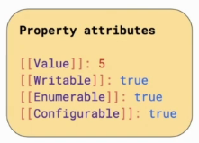

# Primitives

### Find the type of any value
You can do so with:
```javascript
typeof(value);
```

### Primitive Values

    Undefined (undefined), used for **unintentionally** missing values.
    Null (null), used for intentionally missing values.
    Booleans (true and false), used for logical operations.
    Numbers (-100, 3.14, and others), used for math calculations.
    Strings ("hello", "abracadabra", and others), used for text.
    Symbols (uncommon), used to hide implementation details.
    BigInts (uncommon and new), used for math on big numbers.

#### Intresting quirk
```javascript
typeof(null) === 'object';
```

#### Gotchas
```javascript
let reaction = 'yikes';
reaction[0] = 'l';
console.log(reaction); // This will print `yikes`
```
Primitive values are immutable. You can access the first array item similarly to how you would access a string’s first character. It almost feels like strings are arrays (**but they’re not!**).  
**All primitive values are immutable**. “Immutable” is a fancy Latin way to say “unchangeable”. Read-only. You can’t mess with primitive values. At all.  
If you attempt to set a property on a primitive value, be it a number or a string or something else, **JavaScript won’t let you do that**. Whether it will silently refuse your request or error depends on which mode (normal or strict) your code is running in.

### Objects and Functions
#### Object
Javascript objects are just `HashMap` of related properties, where the keys are Strings only.
```javascript
// create an empty object - no class was needed !!
const superhero = {};
 
superhero.name = 'Superman';  
superhero.strength = 100;
```
* `Object.freeze(objRef);`
To avoid property mutation on a certain object.  

It is common to think that Objects in JavaScript are Maps that map string keys to values, but has a little bit more to that:

  

It really maps to this bucket of property attributes, other than the value, it maps to:
* `[[Value]]` the actual value
* `[[Writable]]` value, which states wether the property can be assigned
* `[[Enumerable]]` the property fits in `for ... in` loops 
* `[[Configurable]]` the property can be deleted

You can access this bucket witht the API `Object.getOwnPropertyDescriptor()`.

#### Function
Functions in Javascript are just values of type `Function`, it's a simple as that! 
```javascript
const flyFunction = function() {  
    console.log('Flying like a bird!');
};

const superhero = {};
 
superhero.fly = flyFunction;

// prints 'Flying like a bird!' to the console
superhero.fly();
```

### No Other Types
You might ask: “But what about other types I have used, like `arrays`?”
In `JavaScript`, there are no other fundamental value types other than the ones we have just enumerated. The rest are all `objects`! For example, even `arrays`, `dates`, and `regular expressions` fundamentally are objects in JavaScript:
```javascript
console.log(typeof([])); // "object"
console.log(typeof(new Date())); // "object"
console.log(typeof(/(hello|goodbye)/)); // "object"
```
“I see,” you might reply, “this is because everything is an object!” Alas, this is a popular urban legend, but it’s not true. Although code like `"hi".toUpperCase()` makes `"hi"` seem like an `object`, this is nothing but an illusion. `JavaScript` creates a `wrapper object` when you do this, and **then immediately discards it**.

### Collection of interesting Objects
#### Set
Creates a set, or collection of non reapeated elements (removed duplicates).
```javascript
const mySet = new Set([1, 1, 2, 3, 4]); // keeps 1, 2, 3, 4
```

#### Promises
// TODO

#### Map
// TODO
