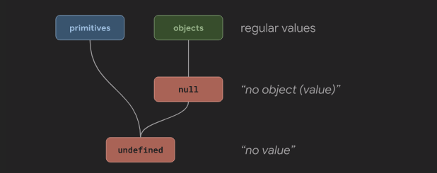

# Types

JS is a **Dynamically Typed Language**, which falls in the category of **value-typed** language.
JavaScript infers or determines the type of a certain variable at run time, which means we are not aware of that time in the very source code.

### Undefined and null
`null` qualifies as an `object` in JavaScript, actually `null` can be used as an empty object pointer:
