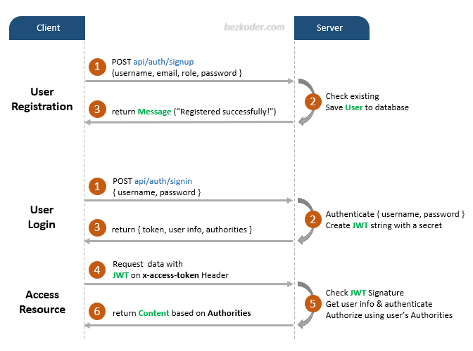

# JWT

### Add in headers
Normally present in the form:
```
Authorization: Bearer [header].[payload].[signature]
```
Alternatively also:
```
x-access-token: [header].[payload].[signature]
```
Flow for JWT authentication:  
  
